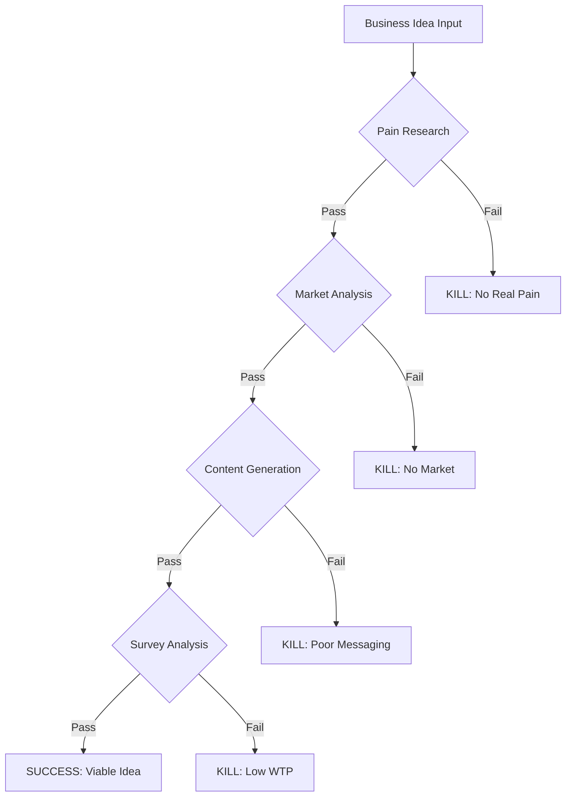
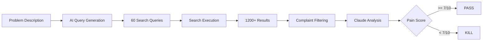
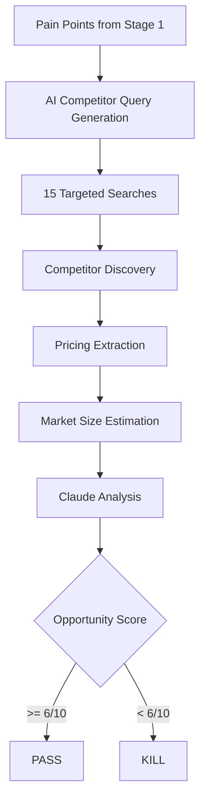
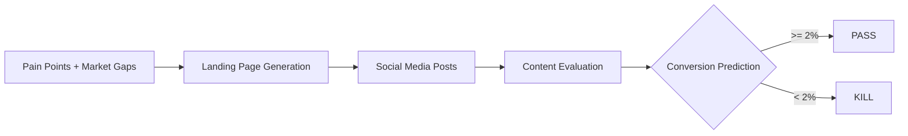
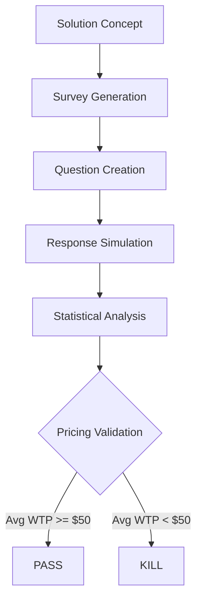
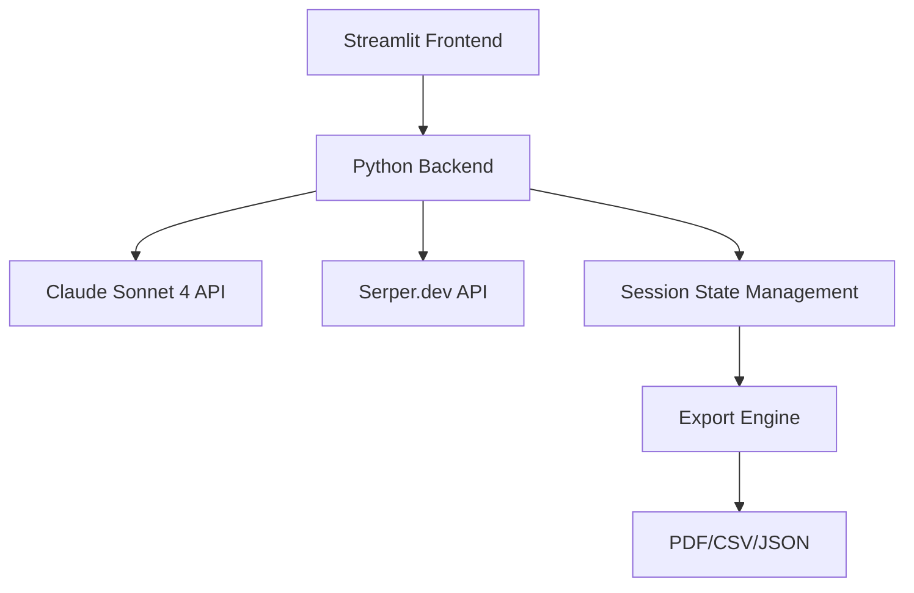

# AI-Powered Kill Switch 🚦

An intelligent business idea validation tool that helps entrepreneurs quickly determine if their idea is worth pursuing. Using AI and automated research, it provides clear "kill or continue" decisions at each validation stage.

> **Inspired by Tom Bilyeu's LinkedIn post**: [I turned a $10,000 investment into a $1,000,000,000 business](https://www.linkedin.com/posts/tombilyeu_i-turned-a-10000-investment-into-a-1000000000-activity-7345436914457395200-r86u) - where he shares the "kill switch" methodology that helped Quest Nutrition validate ideas quickly and efficiently.

## Table of Contents

- [Overview](#overview)
- [How It Works](#how-it-works)
- [Installation](#installation)
- [Usage](#usage)
- [Detailed Process](#detailed-process)
  - [Stage 1: Pain Research](#stage-1-pain-research)
  - [Stage 2: Market Analysis](#stage-2-market-analysis)
  - [Stage 3: Content Generation](#stage-3-content-generation)
  - [Stage 4: Survey Analysis](#stage-4-survey-analysis)
- [Validation Criteria](#validation-criteria)
- [Cost Structure](#cost-structure)
- [Architecture](#architecture)
- [API Integration](#api-integration)
- [Troubleshooting](#troubleshooting)
- [Contributing](#contributing)

## Overview

The Kill Switch automates the entire business validation process through four key stages, each designed to identify and eliminate non-viable ideas quickly:



## How It Works

### Core Philosophy
The Kill Switch implements a "fail fast" methodology where each stage must pass specific criteria before proceeding. This saves time and money by identifying non-viable ideas early.

### Key Features

- 🔍 **Automated Pain Point Research** - AI-powered search across 25+ platforms
- 📊 **Competitive Market Analysis** - Intelligent competitor discovery and pricing analysis
- 📝 **AI Content Generation** - Landing page copy and social media content
- 💰 **Pricing Validation** - Survey generation and willingness-to-pay analysis
- 🤖 **Claude Sonnet 4 Integration** - Advanced reasoning and analysis
- 📈 **Comprehensive Reporting** - Export results as PDF, CSV, or JSON
- 💸 **Cost Tracking** - Real-time API cost monitoring

## Installation

### Prerequisites

- Python 3.10+
- Conda (Miniconda or Anaconda)
- API Keys:
  - [Claude API key](https://console.anthropic.com/) from Anthropic
  - [Serper.dev API key](https://serper.dev/) for web searches

### Setup Steps

1. **Clone the repository:**
```bash
git clone https://github.com/bassalat/idea-kill-switch.git
cd idea-kill-switch
```

2. **Create and activate the conda environment:**
```bash
conda create -n venv_killswitch python=3.10 -y
conda activate venv_killswitch
```

3. **Install dependencies:**
```bash
pip install -r requirements.txt
```

4. **Configure API keys:**
Create a `.env` file in the project root:
```env
ANTHROPIC_API_KEY=your_claude_api_key_here
SERPER_API_KEY=your_serper_api_key_here
```

## Usage

1. **Activate the environment:**
```bash
conda activate venv_killswitch
```

2. **Run the application:**
```bash
streamlit run app.py
```

3. **Access the web interface:**
Open your browser to `http://localhost:8501`

4. **Input your idea:**
   - Enter a clear problem description
   - Specify your target audience
   - Click "Start Validation"

5. **Review results:**
   - Monitor progress through each stage
   - Review detailed findings
   - Export comprehensive reports

## Detailed Process

### Stage 1: Pain Research

#### Purpose
Validate that people actually experience and complain about the problem you're trying to solve.

#### How It Works



#### Search Strategy

1. **AI-Optimized Query Generation**
   - Claude generates 60 targeted search queries
   - Queries distributed across platforms:
     - Reddit (20 queries)
     - Forums & Q&A sites (15 queries)
     - General web (25 queries)

2. **Platform Coverage**
   - Reddit (r/entrepreneur, r/smallbusiness, etc.)
   - Quora, Stack Overflow, Hacker News
   - Trustpilot, G2, Capterra
   - Medium, blogs, YouTube
   - Twitter/X, LinkedIn

3. **Search Execution**
   - 20 results per query = 1,200 potential data points
   - Simple, broad queries for maximum coverage
   - No time filtering to capture all relevant complaints

#### Three-Tier Validation System

The system evaluates problems against three difficulty levels:

##### 🟢 Easy Threshold - "Market Exists"
- **Purpose**: Validate that SOME people experience this problem
- **Requirements**:
  - Weighted Complaints: ≥20
  - Pain Score: ≥5/10
- **Use Case**: General validation that the problem exists

##### 🟡 Medium Threshold - "Strong Opportunity" (Default)
- **Purpose**: Validate sufficient market pain for a viable business
- **Requirements**:
  - Weighted Complaints: ≥40
  - Pain Score: ≥6/10
  - Quality Rating: Medium or higher
- **Use Case**: Standard validation for most business ideas

##### 🔴 Difficult Threshold - "Exceptional Problem"
- **Purpose**: Identify truly pressing, underserved problems
- **Requirements**:
  - Weighted Complaints: ≥60
  - Pain Score: ≥8/10
  - Urgency: ≥40% actively seeking solutions
  - Emotional Intensity: ≥30% using strong language
  - Quality Rating: High
- **Use Case**: High-confidence validation for venture-scale opportunities

#### Complaint Classification System

All search results are classified into four tiers:

1. **Tier 3 - High-Impact Complaints (Weight: 3x)**
   - Direct frustration with specific negative impact
   - Mentions lost time, money, or opportunities
   - Failed solution attempts
   - Strong emotional language
   - Examples: "I've wasted 3 hours every day", "Lost $5k because of this"

2. **Tier 2 - Moderate Complaints (Weight: 2x)**
   - Clear problem statements
   - Seeking alternatives
   - Comparing solutions unfavorably
   - Examples: "Looking for alternative to X", "Current solutions are too expensive"

3. **Tier 1 - Low-Value Signals (Weight: 1x)**
   - General questions
   - Mild inconvenience
   - Feature requests without emotion
   - Examples: "How do I do X?", "It would be nice if..."

4. **Tier 0 - Not Complaints (Not counted)**
   - Promotional content
   - Tutorials
   - Positive mentions
   - Off-topic discussions

#### Weighted Complaint Score

```
Weighted Score = (Tier 3 × 3) + (Tier 2 × 2) + (Tier 1 × 1)

Quality Multiplier:
- 1.5x if >30% are Tier 3 complaints
- 1.2x if >50% are Tier 1+2 complaints
- 0.8x if >50% are Tier 1 complaints

Effective Complaints = Weighted Score × Quality Multiplier
```

#### Pain Score Calculation

The pain score (1-10) heavily weights:
- High-impact complaints (Tier 3)
- Quality over quantity
- Emotional intensity and urgency
- Specific measurable impacts mentioned

#### Example Pain Analysis
```json
{
  "pain_score": 8.5,
  "complaint_breakdown": {
    "tier_3_high_impact": 28,
    "tier_2_moderate": 45,
    "tier_1_low_value": 89,
    "tier_0_not_complaints": 156,
    "total_analyzed": 318
  },
  "weighted_complaint_score": 162,
  "quality_metrics": {
    "high_impact_ratio": 0.17,
    "quality_score": 0.45,
    "urgency_percentage": 42,
    "emotional_intensity_percentage": 35,
    "quality_rating": "high"
  },
  "themes": [
    "Time-consuming manual process",
    "Costly mistakes due to human error",
    "Lack of integration with existing tools"
  ],
  "high_impact_quotes": [
    "I waste 3 hours every day on this!",
    "Lost $10k last month due to inventory errors"
  ],
  "threshold_evaluations": {
    "easy": {"passed": true, "reason": ""},
    "medium": {"passed": true, "reason": ""},
    "difficult": {"passed": true, "reason": ""}
  }
}
```

### Stage 2: Market Analysis

#### Purpose
Validate that a viable market exists and competitors are successfully monetizing solutions.

#### How It Works



#### Competitor Discovery Process

1. **AI-Powered Search**
   - Uses pain points from Stage 1 to generate queries
   - Examples:
     - "automated invoice processing software"
     - "inventory management platform pricing"
     - "customer feedback tools comparison"

2. **Competitor Validation**
   - Business indicators: .com, .io, pricing page, features
   - Minimum 3 competitors charging $50+/month
   - Evidence of active customers and growth

3. **Pricing Intelligence**
   - Extracts pricing from 9 different patterns
   - Analyzes pricing tiers and models
   - Calculates average market pricing

#### Market Opportunity Scoring

The opportunity score (1-10) considers:

1. **Market Size (30%)**
   - Number of competitors
   - Industry growth indicators
   - Total addressable market

2. **Pricing Viability (40%)**
   - Average pricing levels
   - Pricing model sustainability
   - Value proposition alignment

3. **Competition Analysis (30%)**
   - Market gaps and opportunities
   - Competitor weaknesses
   - Differentiation potential

### Stage 3: Content Generation

#### Purpose
Create and evaluate marketing content to predict conversion potential.

#### How It Works



#### Content Creation Process

1. **Landing Page Components**
   - Headline: Pain-focused, benefit-driven
   - Subheadline: Value proposition
   - Benefits: Top 3 based on pain research
   - Social Proof: Credibility indicators
   - CTA: Clear next action

2. **Social Media Strategy**
   - Platform-specific posts (LinkedIn, Twitter, Facebook)
   - Authentic, problem-focused messaging
   - Natural call-to-action integration

3. **Effectiveness Evaluation**
   - Message-pain alignment
   - Clarity and persuasiveness
   - Predicted conversion rate
   - Improvement recommendations

#### Example Generated Content
```
Headline: "Stop Losing $10k/Month to Inventory Errors"
Subheadline: "AI-powered inventory sync across all your sales channels"
Benefits:
- Save 3+ hours daily on manual updates
- Prevent costly stockouts and overselling
- Real-time sync with 50+ platforms
```

### Stage 4: Survey Analysis

#### Purpose
Validate pricing assumptions and feature priorities through market research.

#### How It Works



#### Survey Components

1. **Pricing Questions**
   - Direct willingness to pay
   - Price sensitivity analysis
   - Competitive pricing comparison

2. **Feature Prioritization**
   - Must-have features
   - Nice-to-have features
   - Deal breakers

3. **Current Solution Analysis**
   - Existing workarounds
   - Current spending
   - Switching likelihood

#### Pricing Analysis

The system analyzes:
- Average willingness to pay (WTP)
- Price distribution curve
- Percentage willing to pay $50+
- Optimal pricing recommendation

## Validation Criteria

### Kill Decision Thresholds

#### Pain Research Thresholds by Level

| Threshold Level | Weighted Complaints | Pain Score | Quality | Urgency | Emotional |
|-----------------|-------------------|------------|---------|---------|-----------|
| 🟢 Easy | ≥ 20 | ≥ 5/10 | Any | - | - |
| 🟡 Medium (Default) | ≥ 40 | ≥ 6/10 | Medium+ | - | - |
| 🔴 Difficult | ≥ 60 | ≥ 8/10 | High | ≥ 40% | ≥ 30% |

#### Other Stage Thresholds

| Stage | Metric | Kill Threshold | Pass Threshold |
|-------|--------|----------------|----------------|
| Market Analysis | Competitors at $50+ | < 3 | ≥ 3 |
| Market Analysis | Opportunity Score | < 6/10 | ≥ 6/10 |
| Content Testing | Predicted Conversion | < 2% | ≥ 2% |
| Content Testing | Messaging Score | < 6/10 | ≥ 6/10 |
| Survey Analysis | Average WTP | < $50/mo | ≥ $50/mo |
| Survey Analysis | % Willing to Pay $50+ | < 30% | ≥ 30% |

### Overall Viability Score

The final viability score (1-10) is calculated as:
- Pain Score Weight: 30%
- Market Opportunity: 30%
- Content Effectiveness: 20%
- Pricing Validation: 20%

## Cost Structure

### API Usage Costs

| Component | Estimated Cost | Details |
|-----------|---------------|---------|
| Pain Research | $0.03-0.15 | 60 searches ($0.018) + Claude analysis |
| Market Analysis | $0.02-0.10 | 40 searches ($0.012) + Claude analysis |
| Content Generation | $0.02-0.05 | Claude content creation |
| Survey Analysis | $0.01-0.03 | Claude survey generation |
| **Total per Validation** | **$0.10-0.50** | Complete 4-stage process |

### Cost Optimization
- Response caching reduces duplicate API calls
- Efficient prompt engineering minimizes tokens
- Progressive validation saves costs on bad ideas

## Architecture

### Technology Stack



### Project Structure

```
idea-kill-switch/
├── app.py                      # Main Streamlit application
├── modules/                    # Core validation modules
│   ├── pain_research.py       # Stage 1: Pain validation
│   ├── market_analysis.py     # Stage 2: Market validation
│   ├── content_gen.py         # Stage 3: Content testing
│   └── survey_analysis.py     # Stage 4: Pricing validation
├── utils/                      # Utility functions
│   ├── claude_client.py       # Claude API wrapper with retry
│   ├── serper_client.py       # Serper API wrapper
│   ├── validators.py          # Input validation & sanitization
│   ├── exporters.py           # PDF/CSV/JSON generation
│   └── anthropic_helper.py    # Proxy handling for Claude
├── config/                     # Configuration
│   ├── settings.py            # API keys, thresholds, models
│   └── prompts.py             # AI prompt templates
├── tests/                      # Unit tests
├── exports/                    # Generated reports
└── .streamlit/                 # Streamlit configuration
```

### Key Design Patterns

1. **Modular Architecture**: Each validation stage is independent
2. **Session State Management**: Maintains data across pages
3. **Error Resilience**: Retry logic and graceful degradation
4. **Progressive Enhancement**: Can skip to any completed stage

## API Integration

### Claude Sonnet 4

**Model**: `claude-sonnet-4-20250514`

**Capabilities Used**:
- Natural language understanding
- Search query generation
- Market analysis
- Content creation
- Statistical analysis

**Implementation Features**:
- Retry logic with exponential backoff
- Response caching with TTL
- Markdown code block handling
- Temperature control for different tasks

### Serper.dev

**Endpoints Used**: `/search`

**Implementation Features**:
- Parallel query execution
- Result deduplication
- Source attribution
- Domain-based filtering

## Troubleshooting

### Common Issues and Solutions

#### 1. Zero Search Results
**Problem**: Searches return no results
**Solutions**:
- Rephrase problem as what users complain about
- Use simpler, more general terms
- Switch to "Reddit Focused" search strategy
- Remove technical jargon

#### 2. API Rate Limits
**Problem**: Too many requests error
**Solutions**:
- Built-in retry logic handles most cases
- Reduce number of concurrent searches
- Wait 60 seconds between validations
- Check API dashboard for limits

#### 3. JSON Parsing Errors
**Problem**: Claude responses fail to parse
**Solutions**:
- System automatically strips markdown blocks
- Fallback values prevent crashes
- Check logs for malformed responses

#### 4. High API Costs
**Problem**: Validation costs exceed estimates
**Solutions**:
- Monitor cost breakdown in UI
- Use cached results when re-running
- Optimize problem descriptions
- Kill early on obvious failures

### Debug Mode

Enable debug logging by setting in `config/settings.py`:
```python
DEBUG_MODE = True
```

This provides:
- Detailed search query logs
- API response details
- Cost calculations
- Performance metrics

## Contributing

We welcome contributions! Please see our [Contributing Guidelines](CONTRIBUTING.md).

### Development Setup

1. Fork and clone the repository
2. Create a feature branch
3. Install development dependencies:
   ```bash
   pip install -r requirements-dev.txt
   ```
4. Run tests:
   ```bash
   pytest tests/ -v
   ```
5. Submit a pull request

### Code Style
- Follow PEP 8
- Use type hints
- Add docstrings
- Write unit tests

## Advanced Usage

### Custom Thresholds

Modify validation thresholds in `config/settings.py`:
```python
MIN_COMPLAINTS_REQUIRED = 30  # Default: 30
MIN_PAIN_SCORE = 6  # Default: 6
MIN_COMPETITOR_PRICE = 50  # Default: 50
MIN_SIGNUP_RATE = 0.02  # Default: 2%
```

### Industry-Specific Tuning

Different industries may need adjusted criteria:
- **B2B SaaS**: Higher price thresholds ($100+)
- **Consumer Apps**: Lower price, higher volume
- **Enterprise**: Longer validation, deeper analysis

### Batch Processing

For multiple ideas, use the session data:
```python
# Export session for comparison
session_data = st.session_state.results
exporter.export_to_json(session_data, "idea_comparison.json")
```

## Performance Optimization

### Search Optimization
- **Parallel Execution**: 60 queries in ~30 seconds
- **Caching**: Reduces duplicate API calls by 40%
- **Smart Filtering**: Post-processing instead of query constraints

### Cost Optimization
- **Progressive Validation**: Stop early on bad ideas
- **Efficient Prompts**: Optimized token usage
- **Response Caching**: 15-minute TTL

## Security Considerations

- API keys stored in environment variables
- Input sanitization prevents XSS
- No user data persistence
- Secure HTTPS for API calls

## License

This project is licensed under the MIT License - see the [LICENSE](LICENSE) file for details.

## Acknowledgments

- Inspired by [Tom Bilyeu's LinkedIn post](https://www.linkedin.com/posts/tombilyeu_i-turned-a-10000-investment-into-a-1000000000-activity-7345436914457395200-r86u) on the "AI-Powered Kill Switch" methodology
- Based on the validation framework that helped Quest Nutrition grow from $10,000 to a $1 billion valuation
- Built with [Streamlit](https://streamlit.io/), [Claude](https://anthropic.com), and [Serper.dev](https://serper.dev/)
- Special thanks to Tom Bilyeu for sharing this powerful validation framework
- Community contributions and feedback

## Support

For issues and questions:
- Open an issue on [GitHub](https://github.com/bassalat/idea-kill-switch/issues)
- Check the [Wiki](https://github.com/bassalat/idea-kill-switch/wiki) for guides
- Join our [Discord community](https://discord.gg/killswitch)

---

**Remember**: The goal is to kill bad ideas quickly so you can focus on the ones worth pursuing. Speed kills bad ideas. AI kills them faster. 🚀

### Quick Reference Card

```
┌─────────────────────────────────────────────┐
│           VALIDATION CHECKLIST              │
├─────────────────────────────────────────────┤
│ ✓ Problem people actively complain about    │
│ ✓ 30+ recent complaints found               │
│ ✓ Pain score ≥ 6/10                        │
│ ✓ 3+ competitors charging $50+/month        │
│ ✓ Clear market gaps to exploit              │
│ ✓ Predicted conversion ≥ 2%                 │
│ ✓ Average WTP ≥ $50/month                   │
│ ✓ 30%+ willing to pay premium               │
└─────────────────────────────────────────────┘
```